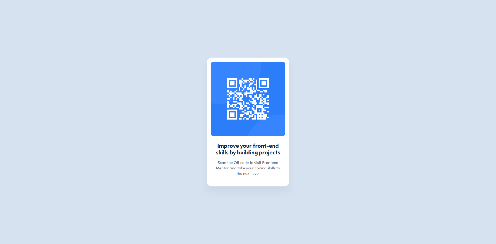

# Frontend Mentor - QR Code Component

## 📖 Overview

This is my solution to the **QR Code Component** challenge from Frontend Mentor.

The goal of this project was to recreate the provided design as accurately as possible using semantic HTML and modern CSS.

## 🔗 Links

- **Frontend Mentor Solution:** *(add after submitting)*
- **Live Site:** [Live Demo](https://yan1620.github.io/QR-code-component/)
- **GitHub Repository:** [Repository](https://github.com/Yan1620/QR-code-component)

## 🛠 Built With

- Semantic HTML5
- CSS3
- Flexbox
- Mobile-first workflow

## 💡 What I Learned

While building this project I practiced:

- Writing clean semantic HTML
- Using Flexbox for layout
- Working with spacing, typography, and border radius
- Creating a responsive component

This project also helped me improve my attention to detail by matching the original design as closely as possible.

## 🚀 Continued Development

In future projects I want to:

- Improve my responsive design skills
- Write cleaner and more maintainable CSS
- Continue learning modern web development
- Move on to JavaScript and React after mastering HTML & CSS

## 👤 Author

- GitHub - [Yan1620](https://github.com/Yan1620)
- Frontend Mentor - [@Yan1620](https://www.frontendmentor.io/profile/Yan1620)

## 🙏 Acknowledgments

Thanks to **Frontend Mentor** for providing high-quality practice projects that help developers improve their frontend skills.